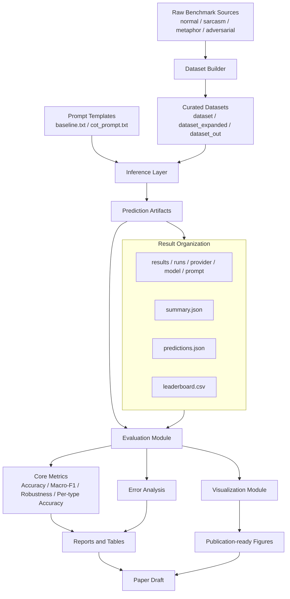

# EmotionBench Overall Architecture

```mermaid
flowchart TD
    A[Raw Benchmark Sources<br/>normal / sarcasm / metaphor / adversarial] --> B[Dataset Builder]
    B --> C[Curated Datasets<br/>dataset / dataset_expanded / dataset_out]

    D[Prompt Templates<br/>baseline.txt / cot_prompt.txt] --> E[Inference Layer]
    C --> E
    E --> F[Prediction Artifacts]

    F --> G[Evaluation Module]
    G --> H[Core Metrics<br/>Accuracy / Macro-F1 / Robustness / Per-type Accuracy]
    G --> I[Error Analysis]
    G --> J[Visualization Module]

    H --> K[Reports and Tables]
    I --> K
    J --> L[Publication-ready Figures]
    K --> M[Paper Draft]
    L --> M

    subgraph R[Result Organization]
        N[results / runs / provider / model / prompt]
        O[summary.json]
        P[predictions.json]
        Q[leaderboard.csv]
    end

    F --> R
    R --> G
```
